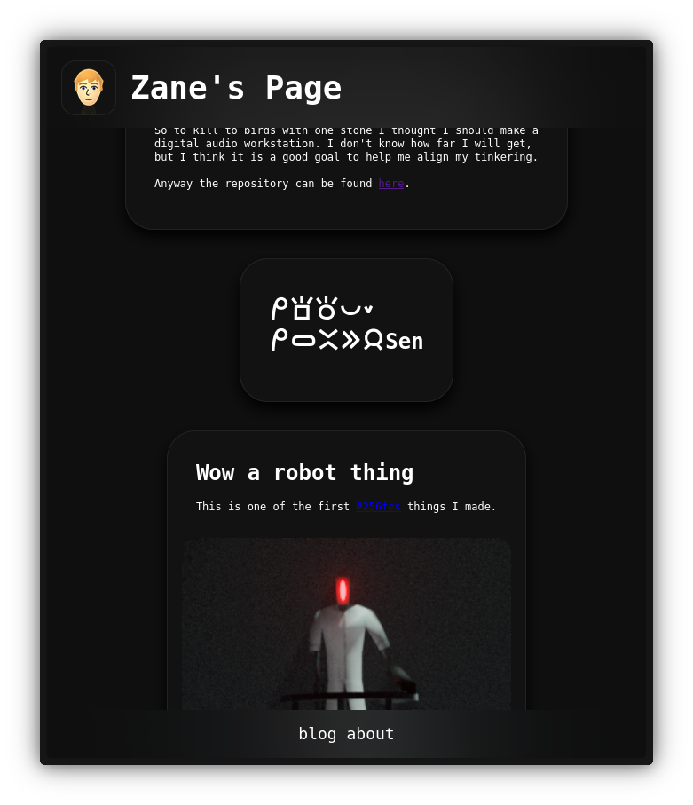

# Web Server Experiments
I use this repository to mess around with low level web technology.
It serves anything placed in the res directory and **automaticly caches** files in memory.
Text files are automaticly compressed using **brotli compression**. It also makes use of a **thread pool** to proccess requests in parallel.



## Build & Run
Prerequisites: Rust toolchain (rustup.rs)

Platform Notes: Was built and tested on Linux. Path related issues may be present on Windows.

```bash
git clone https://github.com/it-is-zane/web_shooter
cd zgpu
cargo run
```
